# 1701QCA Making Interaction - Assessment 2 workbook

When you have completed the template, submit the link to the GitHub Pages site for this repository as a link in Learning@Griffith. The link should be something like [https://qcainteractivemedia.github.io/1701QCA-Assessment2/](https://qcainteractivemedia.github.io/1701QCA-Assessment2/) where `qcainteractivemedia` is replaced with your GitHub username and `1701QCA-Assessment2` is replaced with whatever you called the repository this template is contained in when you set it up.

## Project working title ##
Dancing Spider Halloween Mobile

## Related projects ##
*Find about 6 related projects to the project you choose. A project might be related through  function, technology, materials, fabrication, concept, or code. Don't forget to place an image of the related project in the appropriate folder and insert the filename in the appropriate places below. Copy the markdown block of code below for each project you are showing.*

### Related project 1 ###
Motion Activated Halloween Spider

https://www.instructables.com/id/Motion-Activated-Halloween-Spider/

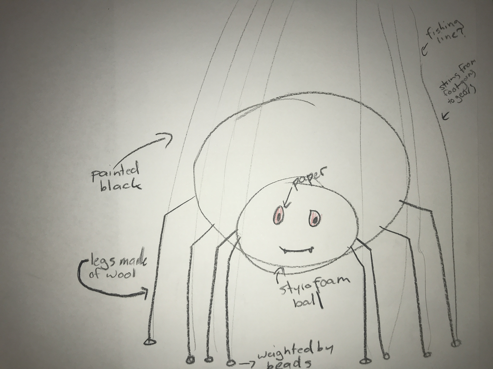

This project is related to mine with the similar use of technology and concept of using a moving spider to scare a person

### Related project 2 ###
Spider Marionette

https://blog.makeitfuncrafts.com/2016/10/22/spider-marionette/

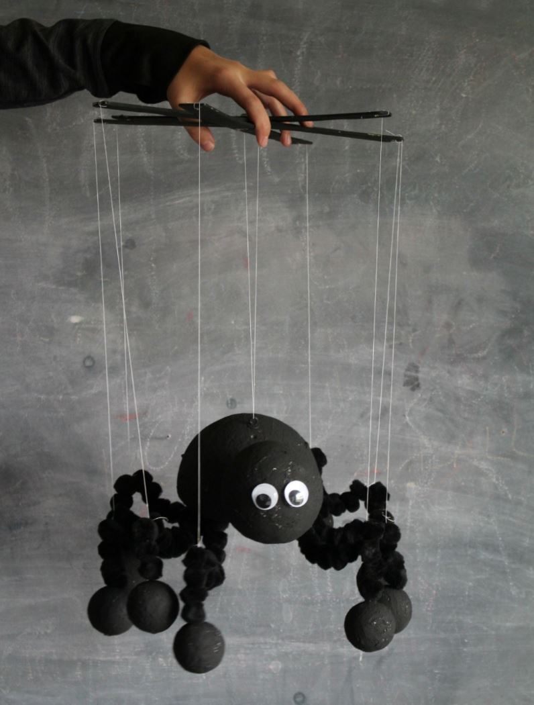

This project is related to mine due to the same concept of using a spider and marionette technology to control it.

## Other research ##
*Include here any other relevant research you have done. This might include identifying readings, tutorials, videos, technical documents, or other resources that have been helpful. For each particular source, add a comment or two about why it is relevant or what you have taken from it.*

### Attatching a PIR Motion Sensor to a micro:bit ###

https://www.teachwithict.com/pir.html

This source provided a tutorial on how to attach a PIR motion sensor to the micro:bit.

### Connecting a Servo Motor to a micro:bit ###

https://www.kitronik.co.uk/blog/using-bbc-microbit-control-servo/

This source demonstrated how to connect a servo motor to the micro:bit.

### Marionette: From Traditional Manipulation to Robotic Manipulation ###

https://link.springer.com/chapter/10.1007%2F1-4020-2204-2_10

This source is focused on the evolution of the manipulation of marionette puppets. This was useful to the development of my project by helping me form an understanding of the function of a marionette and how I can replicate this technology in my project.

## Conceptual progress ##

### Design intent ###
A motor driven mobile that moves under certain conditions

### Design concept 1 ###

Micro:bit baby mobile where the base spins and individual strings move up and down as the motor spins.
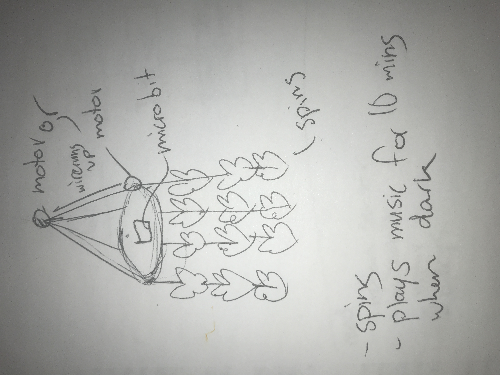

Pros
- Able to include various micro:bit functions such as the use of a motor, light sensor, LED lights and possible various other elements.

Cons
- Similar to products that already exist, will end up making an inferior inversion.
- Need to purchase additional parts such as a motor.

### Design concept 2 ###
A mobile shaped device that you can install under a lamp shade were a motion sensor will detect a persons hand going in to turn on the light, lowering spiders using a motor.
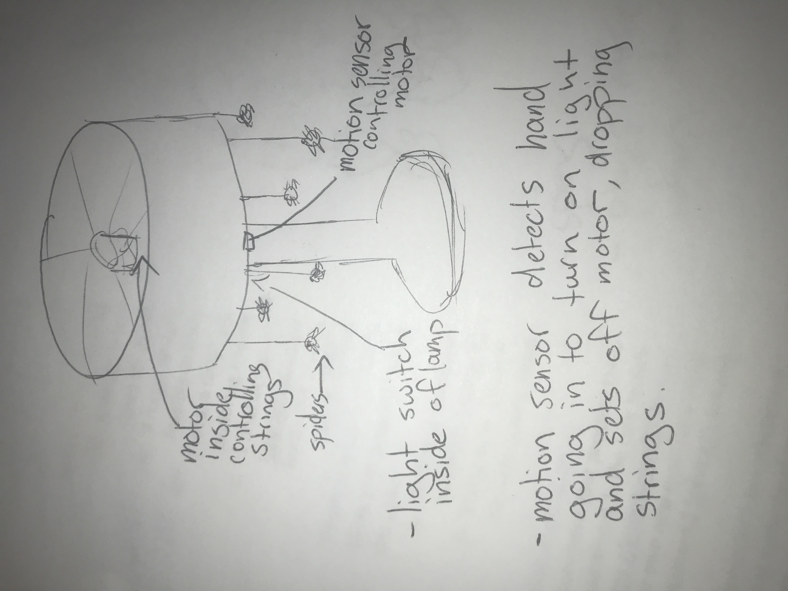

Pros
- The concept will achievable to finish by the end of the course.

Cons
- Difficult it neatly build the mobile under a lamp shade.
- Simple technology- not challenging enough.

### Final design concept ###
A mobile of a single spider where when the motion sensor senses movement, the motor turns, pulling individial strings that move the spiders legs while playing a song.

Pros
- Construction of the project is achievable with elements that are still challenging.
- Sticks to the design intent of a motor controlled mobile, while adding in the idea of using it as a halloween decoration.

Cons
- Need to purchase additional parts (Servo Motor and PIR Motion Sensor).

*This more fully developed concept should include consideration of the interaction scheme, technical functionality, fabrication approach, materials to be used, and aesthetic.*

### Interaction flowchart ###
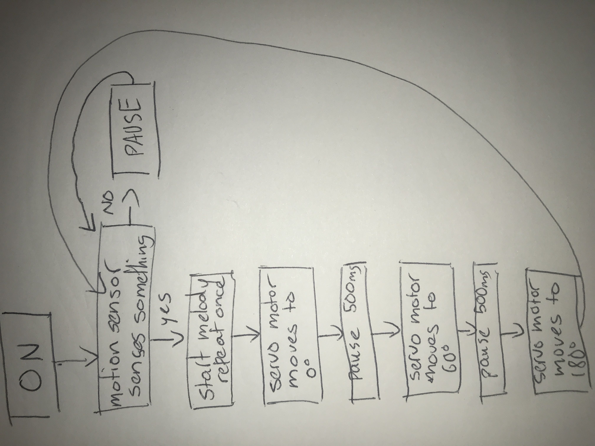

## Physical experimentation documentation ##

*In this section, show your progress including whichever of the following are appropriate for your project at this point.
a.	Technical development. Could be code screenshots, pictures of electronics and hardware testing, video of tests. 
b.	Fabrication. Physical models, rough prototypes, sketches, diagrams of form, material considerations, mood boards, etc.
Ensure you include comments about the choices you've made along the way.*

*You will probably have a range of images and screenshots. Any test videos should be uploaded to YouTube or other publicly accessible site and a link provided here.*

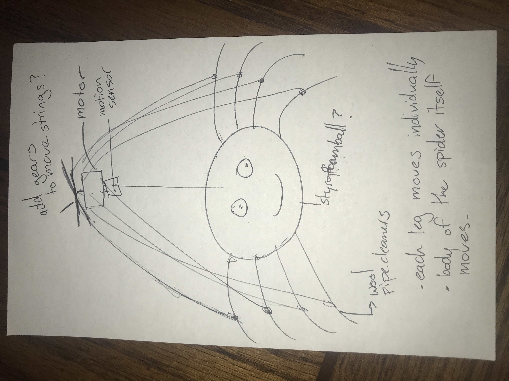

Initial test of the motor included in the Kitronik Inventor's Kit to see if the motor was strong enough to support and move a string. This attempt was unsuccessful- leading to the purchase of the servo motor.
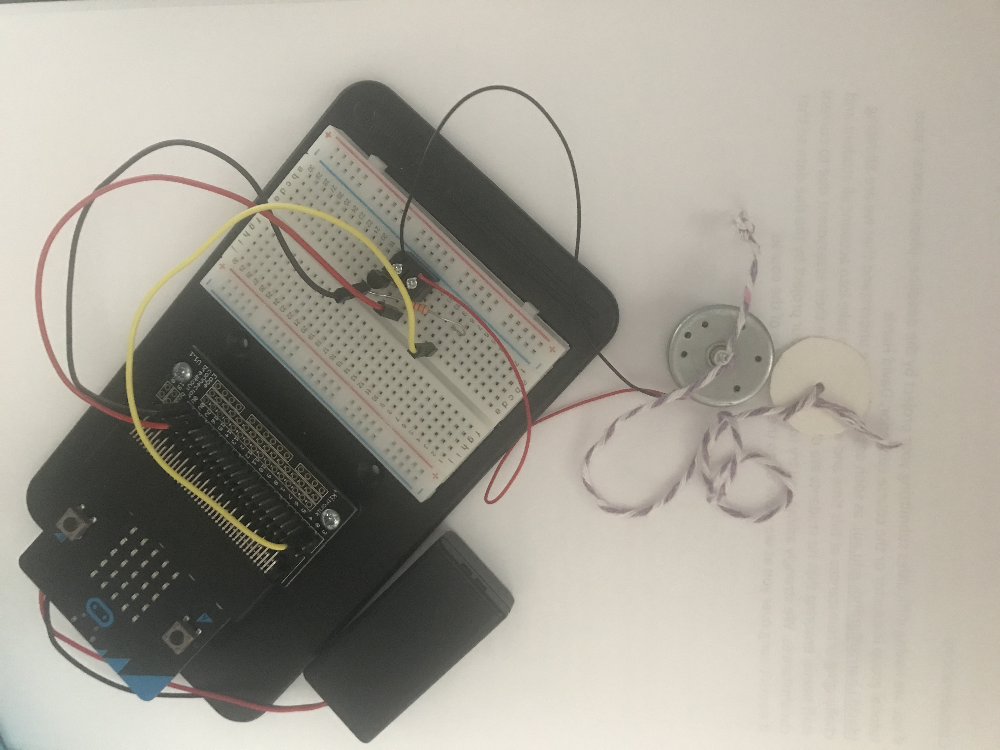

Testing the PIR Motion Sensor
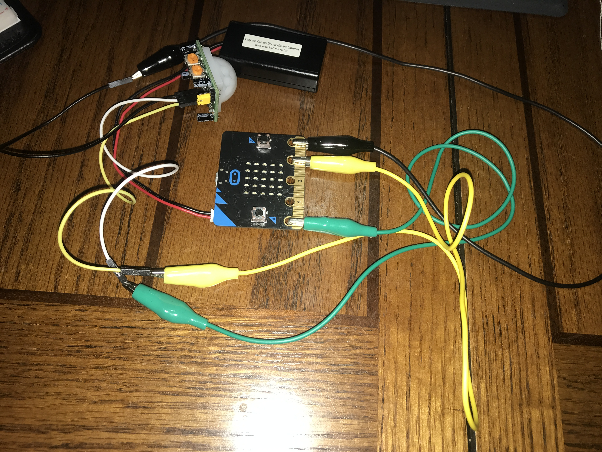
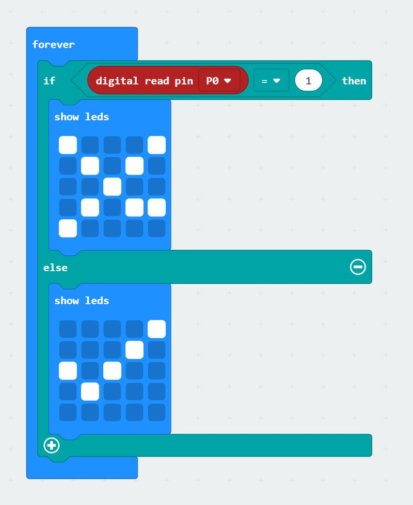

The tests of the PIR Motion Sensor were unsuccessful, most likely due to a lack of power. This is something that will have to be improved before the final project.

Testing the servo motor
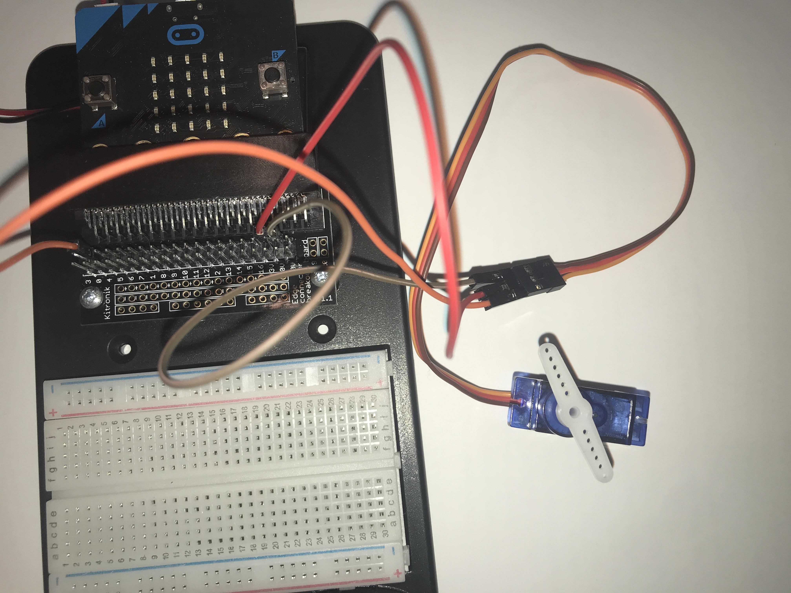
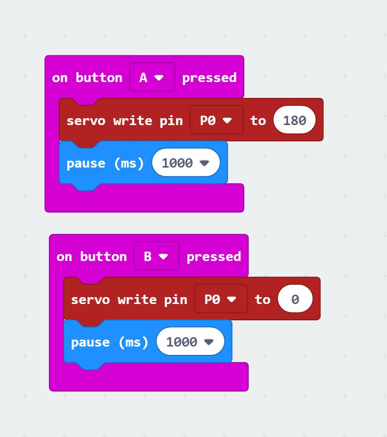

Testing the servo motor with additional weight

Testing the motor and button to move one string

Testing the motor with multiple string connected to one object

## Design process discussion ##
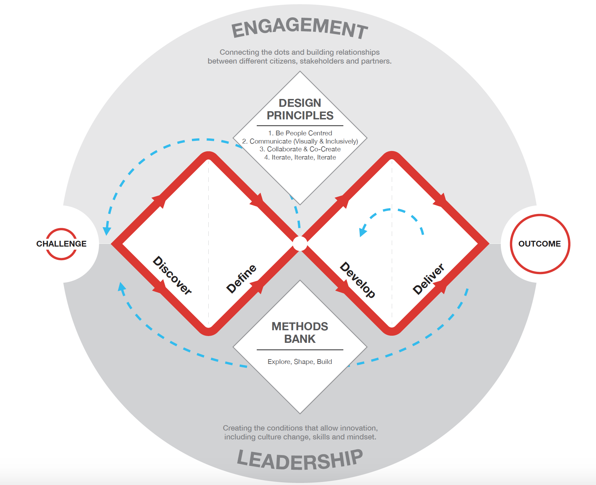

Over the working time for this assignment, my concept has changed numerous times with feedback on ideas, and issues with accessing parts. This evolvement of ideas is reflected in the Double Diamond design process with steps being, discover, define, develop and deliver. The evolution has been though my own development and discovery process with major changes happening after a discussion with course instructor, David. Given the current situation with Covid-19 and online learning, I do believe that this process of feedback and development of the project has been hindered. The process of feedback and evolution of ideas would be much faster if we were on campus with immediate feedback unlike the delay between posting and responding online. With Covid-19, many other challenges have been faced that delayed the development of the project such as access to different parts- which took longer to get then expected, meaning I had less time to get familiar with their technology than I would like. This problem will be resolved before the final project is due as I now have more time with the new parts to test different ideas on how to get them to function efficiently. In the development stage of the Double Diamond process, and brainstorming multiple concepts, inspiration was found in talking to friends and family and hearing their opinions on my ideas to form the final concept. The last section of the double diamond process, deliver, involved testing the different technology and learning the best ways to use them in the final project. Testing the servo motor was ultimately successful with the motor working efficiently with extra weight added. Testing the PIR motion sensor was less successful with the sensor being unreliable- this issue is most likely due to a lack of power and is something that needs to be worked on before the final project is due. The project and prototyping of the project up to this point has involves testing individual parts separately, drawing diagrams of the fabrication and the possible materials the final project will use. The next challenge I will face is to get all the elements working together by testing different solutions on a small scale, rejecting those that don’t work and improving on the ones that will. I will also need to build an aesthetically pleasing base for the project and creating the best connections with the wires. I hope to add more elements to the design, such as lights to further enhance the final product, using the Double Diamond process to revise and expand on concepts to finally deliver on the final design.

## Next steps ##
*Write a list or provide other information about your plan to move the project forward to be ready to present by video and documentation in week 12 of the course.*

- Get the PIR Motion Sensor to work 
    - Test with a different power source
-	Build a prototype spider for testing
    - Purchase parts to build spider
-	Test the use of cogs to move the strings connected to spiders’ legs
-	Test all the elements together
    - Buzzer
    - Servo Motor
    - PIR Motion Sensor
-	Add LED’s if possible
-	Build final base and spider
    - Access materials
      - Hot glue gun, thin wood for base
-	Final testing and minor changes
-	Film and Edit Final Video

